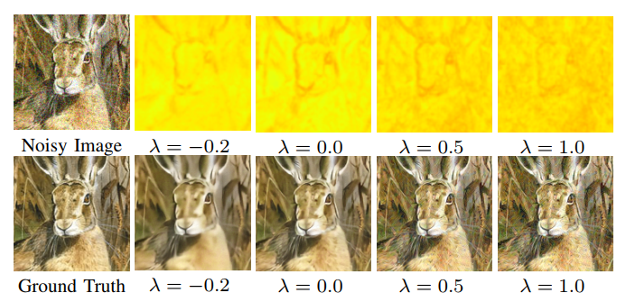
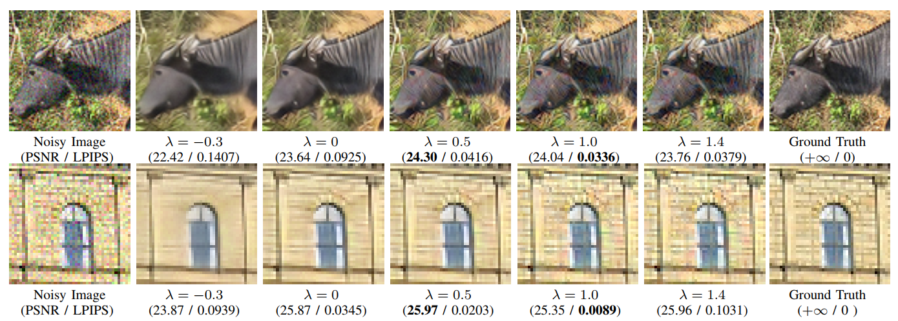
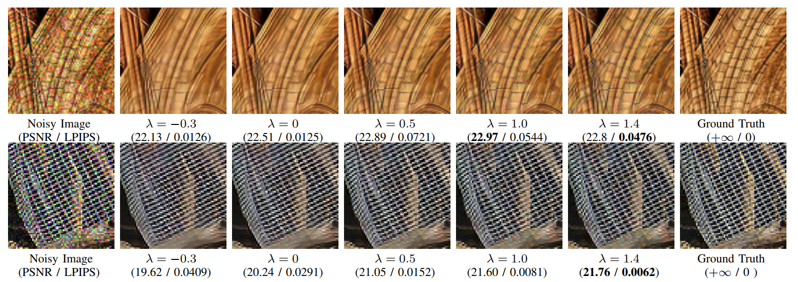
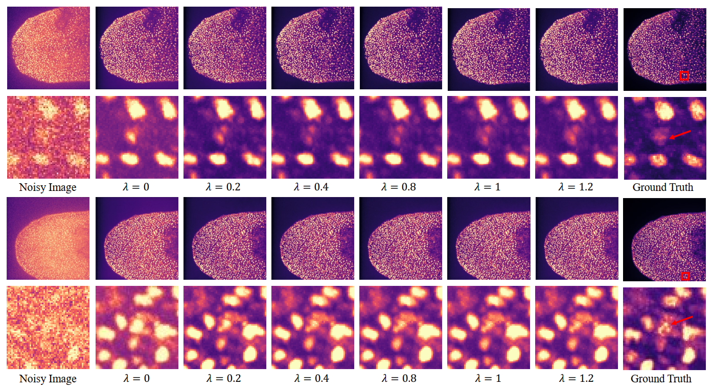

## Towards Interactive Self-Supervised Denoising (TCSVT 2023) [Paper](https://ieeexplore.ieee.org/abstract/document/10059001)

[Mingde Yao](https://scholar.google.com/citations?user=fsE3MzwAAAAJ&hl=en), [Dongliang He](https://scholar.google.com/citations?user=ui6DYGoAAAAJ&hl=en), [Xin Li](https://scholar.google.com/citations?user=4BEGYMwAAAAJ&hl=zh-CN), [Fu Li](https://scholar.google.com/citations?user=yw_waMIAAAAJ&hl=zh-CN), and [Zhiwei Xiong](http://staff.ustc.edu.cn/~zwxiong/)

University of Science and Technology of China (USTC)


:rocket: This is the official repository of Interactive_Self_supervised_Denoising (TCSVT 2023). 


**Our approach allows users to select the denoising output that well suits their perceptual requirements, making it a more subjective and personalized experience.**


We provide the training and test code along with the trained weights and the dataset (train+test) used for this work. If you find this repository useful, please :star:star this repo  and :page_facing_up:cite our paper .

**Reference**:  

> Mingde Yao, Dongliang He, Xin Li, Fu Li, and Zhiwei Xiong, "Towards Interactive Self-Supervised Denoising",
> *IEEE Transactions on Transactions on Circuits and Systems for Video Technology*, 2023.

**Bibtex**:

```
@article{yao2023towards,
  title={Towards interactive self-supervised denoising},
  author={Yao, Mingde and He, Dongliang and Li, Xin and Li, Fu and Xiong, Zhiwei},
  journal={IEEE Transactions on Circuits and Systems for Video Technology},
  year={2023},
  publisher={IEEE}
}
```








## Codes

<!-- This repository is the **official implementation** of the paper, "Towards Interactive Self-Supervised Denoising", where more implementation details are presented. -->


We have two stages for training.

Please run the train.py for training and test.py for testing. 

More details will be updated recently. If you have more questions, please contact me.


## Contact

If you have any problem with the released code, please do not hesitate to open an issue.

For any inquiries or questions, please contact me by email (mdyao@mail.ustc.edu.cn) or WeChat. 
<div align=center></div>
